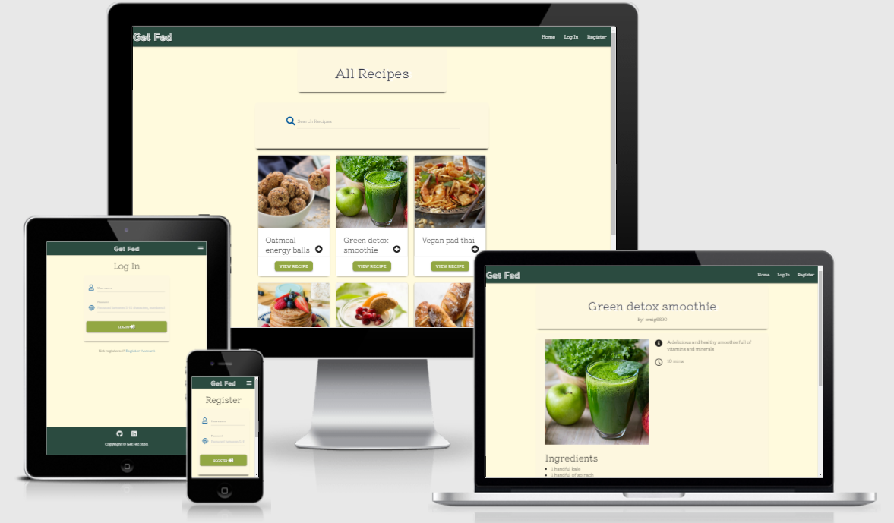

# Welcome to Get Fed. 

## [Live Site](#)

## [GitHub Repo](https://github.com/Craig-Ryan/get-fed-MS3)

Get Fed is my 3rd miilestone project from the [Code Institute](https://codeinstitute.net/) Full Stack Web Development Course. 

# Table of Contents

**

Project overview
**
* [**_Project overview_**](#project-overview)
* [**_User Stories_**](#user-stories)

**

UX
**
* [**_Strategy Plane_**](#strategy-plane)
* [**_Scope Plane_**](#scope-plane)
* [**_Structural Plane_**](#structural-plane)
* [**_Skeleton Plane_**](#skeleton-plane)
* [**_Surface Plane_**](#surface-plane)

    * [_Typography_](#typography)
    * [_Color Scheme_](#colors)
    * [_Media_](#media)

**

Features
**
* [**_Existing Features_**](#existing-features)
* [**_Future Features_**](#future-features)

**

Technologies Used
**
* [**_Languages & Frameworks_**](#languages-and-frameworks)
* [**_Tools_**](#tools)

**

Testing
**
* [**_Testing_**](#testing)

**

Deployment
**
* [**Deployment**](#deployment)

**

Credits
**
* [**_Contents_**](#contents)
* [**_Acknowledgements_**](#acknowledgements)

---

# Project Overview
---
Get Fed is an online cookbook where visitors to the site can browse a selection of recipes added by admin and other users. A visitor will have the choice to simply browse or create their own profile in order to add their own recipes to the site and it's database. Each user will also have the choice to delete their profiles and personal recipes. 

!!! Document your decisions - and the reasons for  these decisions - at each stage of the 5 planes,  
and include this information in  the UX section of your README file. !!!

!!! Speaking of user stories, these are a particularly  important part of your project to define in detail  
before you get started with your coding. They  clearly define the needs and wants of your target  
audience, !!!

---

# User stories

## User
- As a new user, I would like to be able to browse through recipes easily(READ). 
- As a returning user, I would like to have the option to register to add my own recipes(CREATE).
- As a registered user, I would like to be able to add, edit and delete my recipes(CREATE, UPDATE, DELETE).
- As a casual user, I would like to be able to view the recipes on any device comfortably(READ).
- As a user, I would like to see other content on the site relating to cooking i.e, cookbooks, utensils etc(READ).

## Owner
- As owner of the site I would like to be able to moderate user profiles and add/edit/delete recipes(CRUD). 

# UX Planes

## Strategy Plane

- <em>Purpose:</em> The purpose of this project is to showcase my understanding of the materials covered so far in the course. It is the first that time I will be using frontend and backend programming together. The building of this project will consist of a combination of HTML, CSS, jQuery, Javascript, Python, MongoDB, Flask & Jinja.

- <em>Business Goals:</em> The overall business goal of this project is to provide users with an online cookbook that is intuitive from the first visit and sparks a positive emotional response resulting in returning visits from users. The website will provide users with the options to view all recipes across all devices, to register their own account and to be able to add/edit/delete their own recipes. 

- <em>Target Audience:</em> This website appeals to a broad target audience as recipes can range from any level of difficulty due to individual entries. Users have the choice to try any recipe stored on the site or to add their own personal recipes to the database. 

## Scope Plane

- This project serves as an online cookbook for any user to access. My top priority is to design a simple yet effective website that allows a visitor to easily navigate through the site, to browse recipes and to register an account in order to add/edit/delete personal recipes. 

- A search option is included to allow users to locate any recipes they may like to try.

- The content represented has been carefully considered in order to illicit positive emotional responses from individual users and to maximise user interactivity to encourage users to return to the site. 

- A register functionality is available for users wishing to add their own recipes to the site. 

## Structural Plane

- The structure of the site is laid out to be consistent for the benefit of the user. Across each page at the top of the page, there is a navbar with the site's logo and name along with links to other parts of the site such as Log In, Register and Resources. On smaller devices a dropdown menu represented by bars houses the links within the site. 

- On the main index page there is a search bar which allows a user to search a recipe or ingredient by name and all recipes housed in cards for tidy, minimialistic presentation. 

- As the site follows consistent design, each page shares common design traits. The Log In/Register Pages are almost exact copies just with different functionality.

- The resources page consists of hand-picked cooking-related resources from the owner.

- A footer at the bottom of each page houses our copyright information and some links to our social media.

## Skeleton Plane

- The mock-up for this site was created using Balsamiq Wireframes. I wanted to get an idea for the best possible design for the end product of this project. A logo was sourced from Google Images. 

## Surface Plane

- In order to keep with consistency the same colors and fonts are used across the entire project.

### Design 

- The design is responsive across mobile, tablet and personal computer screen sizes. 

### Typography 

- The project uses the fonts X and X from [Google Fonts](https://fonts.google.com/)

### Colors 

The colors used in this project are:

- #fffadd - Site background color
- #2b4b40 - Navbar and footer
- #92a742 - Home, log in, view recipe and register buttons
- #b48c59 - Home, log in, view recipe and register buttons hover effect
- #292c3f - Header text for page headings
- rgba(244,237,229, 0.2) - For card-panels 
- Blue & red - Submit and delete buttons, respectively
- Black for regular text

 sourced from [Maria Haltoff Blog](https://mariahalthoff.com/blog/).

### Media 
- [Maria Haltoff Blog](https://mariahalthoff.com/blog/)food-themed-color-palettes
- [Balsamiq](https://balsamiq.com/)

#### Back to [top](#table-of-contents)

---

# Features

## Existing Features 

### Elements across every page

#### Navbar

- The navbar is consitent across each page on the site. It houses links to the home page next to a logo, the user's profile, a resources page, log in and register pages.

- Non-registered users see a list of options within the navbar as follows:
    1. Home
    2. Log In
    3. Register

- Registered users see a slightly different version of the navbar when logged in:
    1. Home
    1. My Recipes
    1. Add Recipe
    2. Resources
    3. Log Out

- On screens below large resolution, the navbar contents are consolidated into a 'hamburger' menu for better UI.

- Python checks a user's session data in order to retrieve the correct navbar content to be passed through to Jinja to be displayed on the site.

#### Footer

- The footer is designed to be simple and to the point, it contains:
    1. The project's name and copyright information.
    2. Social media links for users to follow.

- Hover effects over buttons are constant across all pages.

### Elements on the 'Home' page:

- A search bar allows users to search recipe names and ingredient names. 
- All recipes are housed in cards 

### Elements on the 'My Recipes' page:

- The user's name is housed in a container displaying the user's name followed by profile.
- Each of the user's personal recipes are stored in a card displayed in a grid.
- An option to add a recipe.

### Elements on the My View Pages

- A stored recipe can be viewed here by anybody.
- The recipe's name and username of it's creator lie on the top of the page.
- The recipe's image is sat next to it's description and time.
- The recipe instructions and methods sit below the image.
- Only the owner of the recipe or admin can make changes to the recipe.
- Buttons for edit and delete appear for the recipe author and admin.
- A home button is displayed below the recipe.

### Elements on the Add Recipe Pages

- A form prompting the user to input the repcipe name, instruction, time, ingredients, method and an image url.
- Buttons with the option to cancel or submit a recipe sit below the form.

### Elements on the 'Resources' page:

- A grid with suggested materials from the owner sit in a grid housed in cards.
- Each card serves as a link to a 3rd party website where users can purchase or learn more about the particular resource.

### Elements on the 'Log In' page:

- A container with the title of 'Log In' prompts a user to enter their details in the form below.
- A form asks a user to input 'Username' and 'Password' details folowed by a 'Submit' button.
- On successful entry, a user is brought to their unique profile or 'My Recipes' page.
- Unsuccessful entries result in a flash message that prompts the user to re-enter their details.

### Elements on the 'Register' page

- A container with the title of 'Register' prompts a user to enter their details in the form below.
- A form asks a user to input 'Username' and 'Password' details folowed by a 'Submit' button.
- On entry, a user is brought to their unique profile or 'My Recipes' page.

## Future Features 

- A favorite button for users to add other recipes to their profiles.
- A review comment functionality under individual recipes.
- A share function for users to share recipes from clicking an icon rather than copy/paste-ing the link address.
- The ability for users to upload images as files.

#### Back to [top](#table-of-contents)

# Technologies used

## Languages and Frameworks

- [HTML5](https://developer.mozilla.org/en-US/docs/Web/HTML) - used to build the site structure.
- [CSS3](https://developer.mozilla.org/en-US/docs/Web/CSS) - used to add personal styling to the site.
- [JavaScript](https://developer.mozilla.org/en-US/docs/Web/JavaScript) - used for adding personalised functionality on the site i.e adding/editing/deleting content. 
- [Jinja](https://flask.palletsprojects.com/en/1.1.x/) - used to display data from the backend to the frontend.
- [jQuery](https://jquery.com/) - used in conjunction with Materialize code for functionality of hover states for example. 
- [Python](https://www.python.org/) - used to write logic for running the site. 
- [Flask](https://flask.palletsprojects.com/en/1.1.x/) - used to improve efficient use of HTML templates.
- [MongoDB](https://www.mongodb.com/) - used as the database to house the data of this site.
- [Materialize](https://materializecss.com/) - used to apply clean styling to the site's pages.
- [Heroku](https://www.heroku.com/) - used to host the site. 
- [Font Awesome](https://fontawesome.com/) - used for icons for better UX. 
- [Google Fonts](https://fonts.google.com/) - source of the typography used in this project.
- [dnspython](https://pypi.org/project/dnspython/) - recommended Python DNS toolkit.
- [PyMongo](https://flask.palletsprojects.com/en/1.1.x/) - used to communicate between Python and MongoDb.

## Tools

- [Git](https://git-scm.com/) - for version control and development throughout the entirety of this project.
- [GitHub](https://github.com/) - for hosting the repositiory for this project.
- [Balsamiq](https://balsamiq.com/) - for designing the wireframes.
- [RandomKeyGen](https://randomkeygen.com/) For generating random passwords. 
- [AmIResponsive](http://ami.responsivedesign.is/) for generating the responsive image at the beginning of this README.
- [W3C Validator](https://validator.w3.org/) - used to check for errors in HTML.
- [W3C Validator CSS](https://validator.w3.org/css-validator/) - used to check for errors in CSS.
- [PEP8 Online](http://pep8online.com/) - used to check for errors in Python and assure it was PEP8 complient.
- [Lighthouse](https://developers.google.com/web/tools/lighthouse) - used to measure performance, progressiveness, SEO, responsiveness, accessibility & best pracitices.
- [JSHint](https://jshint.com/) - used to check for errors in JavaScript code.
- [Favicon](https://favicon.io/) - for generating the icon in the webpage tab.

#### Back to [top](#table-of-contents)

# Testing

- Documentaion of testing can be found by going to the link below.  
[View the testing.md file here](TESTING.md).

#### Back to [top](#table-of-contents)

# Deployment

## To view using GitHub:

1. View the [Get Fed](https://github.com/Craig-Ryan/get-fed-MS3) project repository.
1. Copy the link for the cloned repository.
1. In the CLI navigate to the folder where you want to clone the repository.
1. Type git clone and then paste the copied URL.
1. Press Enter
1. Install all requirements by typing `pip install -r requirements.txt`
1. You need to add an env file to the root directory ensuring the env.py is added to the .gitignore file for security measures.
1. Add your the following to your env file:
- os.environ.setdefault("IP", "0.0.0.0")
- os.environ.setdefault("PORT", "5000")
- os.environ.setdefault("MONGO_URI", "YOUR_MONGODB_URI")
- os.environ.setdefault("SECRET_KEY", "ADD_YOUR_SECRET_KEY")
- os.environ.setdefault("MONGO_DBNAME", "YOUR_MONGO_DBNAME")

  Make sure you add your own MONGO_URI, SECRET_KEY & MONGO_DBNAME.

You will also have to set up an env.py file in the root directory of your project, and set up variables for IP, PORT, SECRET_KEY, MONGO_URI and MONGODB_NAME. In addition, you will have to setup a new collection and databases for the project in MongoDB.

The file should now be ready to run from your IDE by typing `python3 app.py`

## To view on Heroku:

1. Create the 'requirements.txt' file to house the dependencies. Do this in the terminal by typing: pip3 freeze > requirements.txt
1. Create a 'Procfile' (ensure it starts with a capital P), this tells Heroku how to run the project. Type into the terminal: echo web: python app.py > Procfile
1. You'll need to save these files to the GitHub repositiory. Type 'git add -A', 'git commit -m "Commit Message"' & 'git push' into the terminal to push the files to Github.
1. Log in to [Heroku](https://www.heroku.com/)
1. In the top right corner, click 'New' to create a new app.
1. Add a unique name and your region.
1. Now link the Github repository to your new Heroku app: 
- In the 'Deploy' tab, in the section 'Deployment Method' click on the 'GitHub' option.
- Below next to your GitHub username add the name of the GitHub repository in the empty box.
1. Go to 'Settings' > Reveal Config Vars and add the following:
- IP:  0000
- PORT: 5000
- MONGO_URI: input link to MongoDB Database
- SECRET_KEY: Input your own secret key
1. Go back to 'Deploy' scroll down to 'Manual Deployment' and click 'Deploy Branch'.
1. When Heroku has finished loading you can click on the 'View' button to launch your deployed app.

#### Back to [top](#table-of-contents)

# Credits

## Contents

### Recipes and 3rd-party content included in this project:
- [Vegan Pad Thai](https://www.noracooks.com/vegan-pad-thai/)
- [Green Detox Smoothie](https://damndelicious.net/2018/01/01/green-detox-smoothie/)
- [Oatmeal Energy Balls](https://www.youtube.com/watch?v=-UZNjbjAkrg&t=99s)
- [Artisanal Bread](https://sallysbakingaddiction.com/homemade-artisan-bread/#tasty-recipes-80079)
- [Kitchen Confidential Image](https://www.dubraybooks.ie/kitchen-confidential-insiders-edition_9781408845042)
- [Ugly Delicious Netflix](https://www.google.com/url?sa=i&url=https%3A%2F%2Fwww.netflix.com%2Fgr-en%2Ftitle%2F80170368&psig=AOvVaw20SwJjkSriwAZhxEFwgWMN&ust=1617024629155000&source=images&cd=vfe&ved=2ahUKEwiki5emjNPvAhXMRcAKHSzgDbMQr4kDegUIARDCAQ)
- [The Four Hour Chef](https://www.amazon.co.uk/4-Hour-Chef-Learning-Anything-Official/dp/1477800077)

## Acknowledgements

- For help with building the 404 page is used this [geeksforgeeks](https://www.geeksforgeeks.org/python-404-error-handling-in-flask/) article.
- My mentor Guido Cecilio guided me through the entirety of this project.
- Most of the structure and guidance for this project was done with the help of the [Code Institute Flask Mini Project](https://learn.codeinstitute.net/courses/course-v1:CodeInstitute+DCP101+2017_T3/courseware/9e2f12f5584e48acb3c29e9b0d7cc4fe/054c3813e82e4195b5a4d8cd8a99ebaa/)
- Thank you to my peers, friends and family for guidance during the development of this project.

#### Back to [top](#table-of-contents)