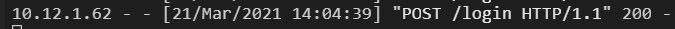

# testing <em>*Note, due to time contstraints I had no chance to finish this document.</em> 

## Manual Testing

### External Links

All external links are functioning as expected.

### Log In
Log in function works fine.

 
### Error Messages

I ran the code through the [WS3 HTML Validator](https://validator.w3.org/nu/) and the [WS3 CSS Validator](https://jigsaw.w3.org/css-validator) which returned a substanitial amount of errors. Due to time restraints I am unable to amend these issues and the code is running as expected.

